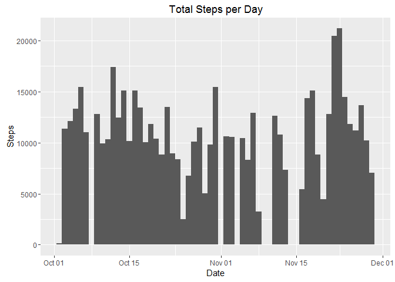
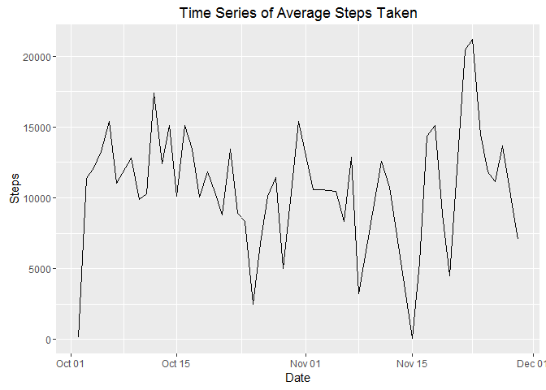
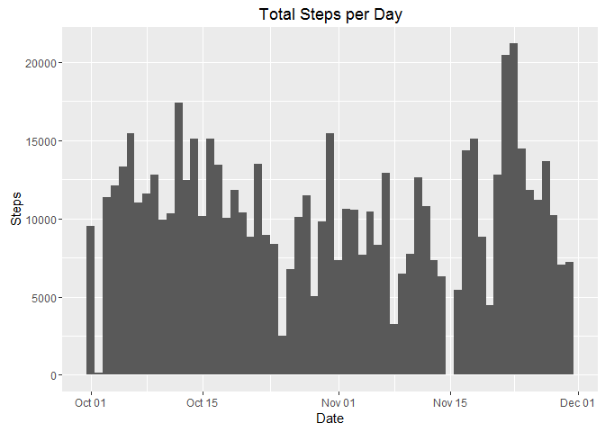
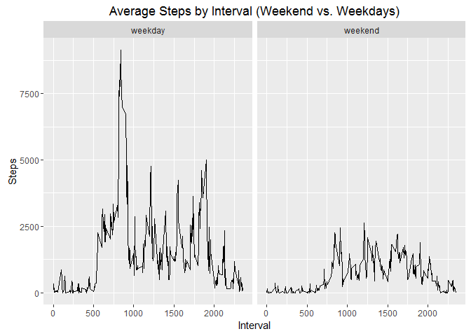

# Reproducible Research: Peer Assessment 1


```r
library(knitr)
library(ggplot2)
library(dplyr)
```

```
## 
## Attaching package: 'dplyr'
```

```
## The following objects are masked from 'package:stats':
## 
##     filter, lag
```

```
## The following objects are masked from 'package:base':
## 
##     intersect, setdiff, setequal, union
```

```r
library(mice)
```

```
## Loading required package: Rcpp
```

```
## mice 2.25 2015-11-09
```

```r
opts_chunk$set(echo = TRUE)
```

## Loading and preprocessing the data

```r
#download.file('https://d396qusza40orc.cloudfront.net/repdata%2Fdata%2Factivity.zip', destfile = 'activity.csv')

activity<- read.csv('activity.csv', header = TRUE)
activity <- activity[!is.na(activity$steps),]
activity$date <- as.Date(activity$date)
activity$steps <- as.numeric(as.character(activity$steps))
```


## What is mean total number of steps taken per day?

```r
date_steps <- activity %>% group_by(date) %>% summarise(total_steps = sum(steps))

ggplot(date_steps) + geom_histogram(aes(x = date, weight = total_steps), binwidth = 1) + xlab("Date") + ylab("Steps") + ggtitle("Total Steps per Day")
```

<!-- -->

## What is mean total number of steps taken per day?

```r
date_stats <- activity %>% group_by(date) %>% summarise(total_steps = sum(steps), mean = mean(steps), median = median(steps))
print(date_stats, n = 53)
```

```
## # A tibble: 53 x 4
##          date total_steps       mean median
##        <date>       <dbl>      <dbl>  <dbl>
## 1  2012-10-02         126  0.4375000      0
## 2  2012-10-03       11352 39.4166667      0
## 3  2012-10-04       12116 42.0694444      0
## 4  2012-10-05       13294 46.1597222      0
## 5  2012-10-06       15420 53.5416667      0
## 6  2012-10-07       11015 38.2465278      0
## 7  2012-10-09       12811 44.4826389      0
## 8  2012-10-10        9900 34.3750000      0
## 9  2012-10-11       10304 35.7777778      0
## 10 2012-10-12       17382 60.3541667      0
## 11 2012-10-13       12426 43.1458333      0
## 12 2012-10-14       15098 52.4236111      0
## 13 2012-10-15       10139 35.2048611      0
## 14 2012-10-16       15084 52.3750000      0
## 15 2012-10-17       13452 46.7083333      0
## 16 2012-10-18       10056 34.9166667      0
## 17 2012-10-19       11829 41.0729167      0
## 18 2012-10-20       10395 36.0937500      0
## 19 2012-10-21        8821 30.6284722      0
## 20 2012-10-22       13460 46.7361111      0
## 21 2012-10-23        8918 30.9652778      0
## 22 2012-10-24        8355 29.0104167      0
## 23 2012-10-25        2492  8.6527778      0
## 24 2012-10-26        6778 23.5347222      0
## 25 2012-10-27       10119 35.1354167      0
## 26 2012-10-28       11458 39.7847222      0
## 27 2012-10-29        5018 17.4236111      0
## 28 2012-10-30        9819 34.0937500      0
## 29 2012-10-31       15414 53.5208333      0
## 30 2012-11-02       10600 36.8055556      0
## 31 2012-11-03       10571 36.7048611      0
## 32 2012-11-05       10439 36.2465278      0
## 33 2012-11-06        8334 28.9375000      0
## 34 2012-11-07       12883 44.7326389      0
## 35 2012-11-08        3219 11.1770833      0
## 36 2012-11-11       12608 43.7777778      0
## 37 2012-11-12       10765 37.3784722      0
## 38 2012-11-13        7336 25.4722222      0
## 39 2012-11-15          41  0.1423611      0
## 40 2012-11-16        5441 18.8923611      0
## 41 2012-11-17       14339 49.7881944      0
## 42 2012-11-18       15110 52.4652778      0
## 43 2012-11-19        8841 30.6979167      0
## 44 2012-11-20        4472 15.5277778      0
## 45 2012-11-21       12787 44.3993056      0
## 46 2012-11-22       20427 70.9270833      0
## 47 2012-11-23       21194 73.5902778      0
## 48 2012-11-24       14478 50.2708333      0
## 49 2012-11-25       11834 41.0902778      0
## 50 2012-11-26       11162 38.7569444      0
## 51 2012-11-27       13646 47.3819444      0
## 52 2012-11-28       10183 35.3576389      0
## 53 2012-11-29        7047 24.4687500      0
```

## What is the average daily activity pattern?

```r
ggplot(date_stats, aes(x = date, y = total_steps)) + geom_line() + xlab("Date") + ylab("Steps") + ggtitle("Time Series of Average Steps Taken")
```

<!-- -->

#Time Interval with Maximum Number of Steps (on average)

```r
interval_stats <- activity %>% group_by(interval) %>% summarise(total_steps = sum(steps), mean = mean(steps), median = median(steps))

max_avg_steps_in_interval <- max(interval_stats$total_steps)

max_interval <- interval_stats[interval_stats$total_steps == max_avg_steps_in_interval,]
```
##The interval with the maximum number of average steps is 835.

===============================================================

## Imputing missing values

```r
activity<- read.csv('activity.csv', header = TRUE)
activity$steps <- as.numeric(as.character(activity$steps))
md.pattern(activity)
```

```
##       date interval steps     
## 15264    1        1     1    0
##  2304    1        1     0    1
##          0        0  2304 2304
```

##Use **mice** package to impute data

```r
impute_activity <- mice(data = activity, me = 5, method = "pmm", maxit = 50, seed = 500)

activity_imputed <- complete(impute_activity, 1)
```

#Total Number of Steps Taken Each Day After Imputing

```r
activity_imputed$date <- as.Date(activity_imputed$date)

ggplot(activity_imputed) + geom_histogram(aes(x = date, weight = steps), binwidth = 1) + xlab("Date") + ylab("Steps") + ggtitle("Total Steps per Day")
```

<!-- -->

## Are there differences in activity patterns between weekdays and weekends?

```r
activity_wkdy <- activity_imputed %>% mutate(wkday = weekdays(activity_imputed$date))

activity_wkdy <- activity_wkdy %>% mutate(wkday_type = ifelse(wkday %in% c("Monday", "Tuesday", "Wednesday", "Thursday", "Friday"), "weekday", "weekend"))

interval_stats <- activity_wkdy %>% group_by(interval, wkday_type) %>% summarise(total_steps = sum(steps), mean = mean(steps), median = median(steps))

ggplot(interval_stats, aes(interval, total_steps)) + geom_line() + facet_grid(.~wkday_type) + ggtitle("Average Steps by Interval (Weekend vs. Weekdays)") + xlab("Interval") + ylab("Steps")
```

<!-- -->
